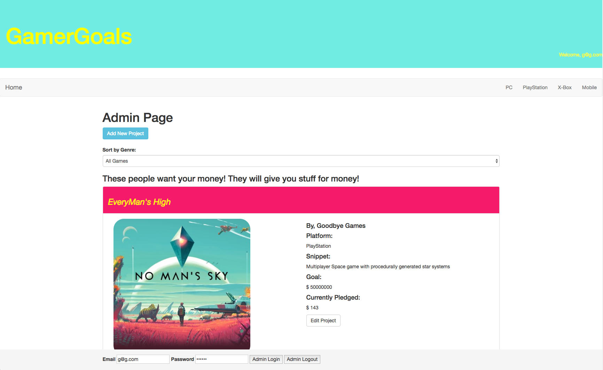

# GamerGoals



This project was generated with [Angular CLI](https://github.com/angular/angular-cli) version 1.1.1.

## By Grady Shelton and Nicole Santamaria

## User Stories

* As a user, I want to see a list of all gaming projects that are seeking funding.
* As a user, I want to click a project to see more details.
* As a user, I'd like to know the details of a project before I decide whether to fund it. Including things like a name, the project authors, a description, the amount of money the project is hoping to raise, what they'll do with the funds raised, and whether I get any cool rewards for funding a project.
* As a user, I want to be able to filter projects as I browse them by gaming genre.
* As a user, I want to click a button or fill out a form to fund a project.
* As a user, I want the option to post my own project that seeks funding.
* As an administrator, I want to add, update, or delete projects as necessary. (User authentication is required).
* As a user, I want to select a platform to view a page containing all projects in that platform.

## Prerequisites

You will need the following things properly installed on your computer.

* [Git](https://git-scm.com/)
* [Node.js](https://nodejs.org/) (with NPM)
* [AngularCLI](https://cli.angular.io/)

## Installation

* `git clone https://github.com/nrsantamaria/GamerGoals`
* `cd GamerGoals`
* `npm install`
* `bower install bootstrap --save`

## Firebase Integration

* Create a firebase account at `https://firebase.google.com`
* Add a new project to your firebase account
* Create a file in the app folder labeled api-keys.ts
* Add the following to your api-keys file:

```
export var masterFirebaseConfig = {
    apiKey: "xxxx",
    authDomain: "xxxx.firebaseapp.com",
    databaseURL: "https://xxxx.firebaseio.com",
    storageBucket: "xxxx.appspot.com",
    messagingSenderId: "xxxx"
  };
```

## Development server

Run `ng serve` for a dev server. Navigate to `http://localhost:4200/`. The app will automatically reload if you change any of the source files.

## Useful Tips

* To review content in atom with TypeScript Package install the following:
* `apm install atom-typescript`

* If you receive the following error: Error: Can't resolve 'promise-polyfill'
* Run `npm install promise-polyfill --save-exact`

* If you get some other weird firebase related error use the following to find out what file is out of date.
* Run `npm list`

## Support and Contact Details
* Please contact Nicole Santamaria at NicoleRSantamaria@gmail.com if you have any questions.
* Please contact Grady Shelton at Gradyish@gmail.com if you have any questions.

## License
This software is licensed under MIT license.

Copyright (c) 2017 Nicole Santamaria and Grady Shelton
